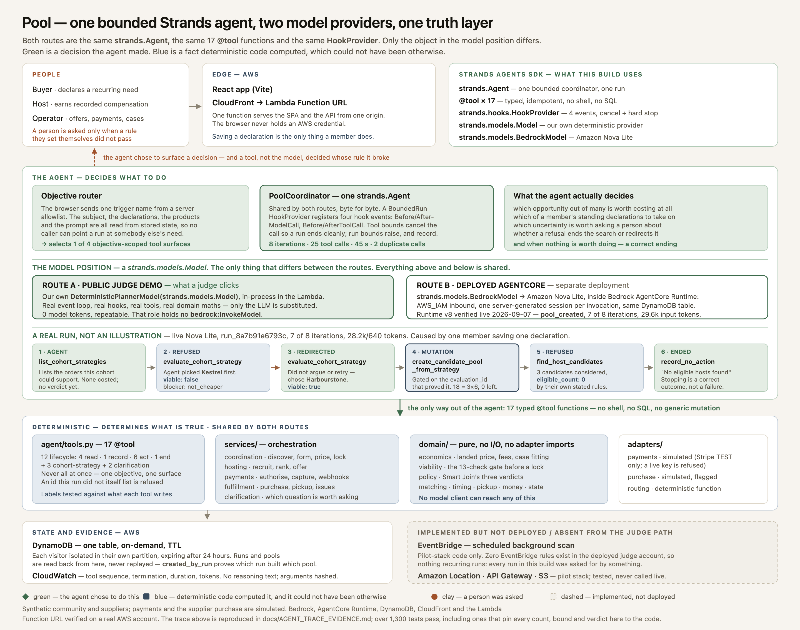

# Pool

**Nobody organised the group. Pool noticed.**

Pool finds the moment when several people in one community independently need the same
thing, works out whether buying it together is genuinely worth it, recruits a local
fulfiller with buyer-funded compensation, and runs the coordination that makes the
informal version collapse.

Built for the [AWS Agents for Humans hackathon](https://agentsforhumans.devpost.com/) —
**Good Neighbor Agents** track. The value is structurally collective: one person alone
cannot create it.



*[SVG](docs/architecture-strands.svg) · [PNG](docs/architecture-strands.png). The one
thing to take from it: **both routes are the same `strands.Agent`, the same 17 `@tool`
functions and the same `HookProvider` — only the object in the model position differs.**
The public judge demo puts our own deterministic `strands.models.Model` there and spends
zero tokens; the deployed AgentCore runtime puts `strands.models.BedrockModel` → Amazon
Nova Lite there. Neither one gets to decide a price. The middle band is a real recorded
run, not an illustration; the bottom band is [what happened when the deployed runtime was
attacked](#what-happens-when-you-attack-it). The earlier
[deployment-shaped diagram](docs/architecture.svg) is still accurate and still tracked.*

**Judge, in a hurry?** [The demo](#open-this-first) ·
[how Strands is actually used](#how-strands-is-actually-used) ·
[reproduce the key path in one command](#reproduce-the-kestrelharbourstone-path) ·
[**what happens when you attack it**](#what-happens-when-you-attack-it) ·
[the deterministic truth boundary](#ai-decides-what-to-do-deterministic-code-determines-what-is-true) ·
[verified AgentCore deployment](#aws) ·
[what is synthetic](#local-mode-and-what-is-not-real).

---

## Open this first

You need [`uv`](https://docs.astral.sh/uv/) and Node 20+. Nothing else: `uv` fetches
Python 3.13 itself, and no AWS account, credential or API key is involved below.

```bash
make install     # Python agent, web app, CDK deps
make demo-local  # judge mode, one origin on :8000, offline and free
```

Then open **<http://localhost:8000/verify>**.

No signup, no password, no credentials, and nothing to arrange. You arrive as an ordinary
member of a synthetic community that already buys coffee and disagrees about which coffee.

Press **Start — add what you buy**, then **Add a need**, and type **`coffee`**. Pool offers
the *family* first — "Coffee, any of 26" — because that is usually the sentence. Underneath
it is **Or pick one exact product (6)**: those six are the coffees this community actually
buys, and Pool holds a verified bulk quote for every one.

**Pick Kestrel Roastworks, whole bean, medium roast.** Any of them produces a real run, but
that one produces *this* run, the one the rest of this page quotes numbers from — and
picking Harbourstone instead would hand you the answer rather than the refusal that makes
it interesting. Leave the defaults at three bags every thirty days. Choose **Any brand that
matches my preferences**, tick **Dark** alongside Medium, leave *whole bean* and
*caffeinated* on, and save.

That is the whole interaction, and it is enough to produce the run this submission is
about: Pool costs the option with the most demand behind it, deterministic code refuses it
because buying it together is *more expensive*, and the agent tries a different compatible
option instead. Details in [the walkthrough
below](#reproduce-the-kestrelharbourstone-path) — but you do not need them to see it
happen.

**Saving is the only thing you do** on this path — nothing here asks you to press *run*.
Home does carry an **Ask Pool to check now** button, and on this deployment it runs the
same bounded loop with the same deterministic planner, at zero model tokens: live model
invocation is switched off on the public demo (`PUBLIC_DEMO_AGENTCORE_ENABLED=false`), so
there is no control a judge can press that spends a token. The declaration writes a durable
coordination event, one bounded agent run answers it, and Home changes — into an order, or
into a truthful *watching*, depending on what you actually said. Every row that changed can
tell you why, and **Technical proof for this run** shows the run that produced it: run id,
event id, tool sequence, model, the options it was offered and the deterministic verdicts
that separated them.

**On location:** Pool never asks your browser for a position, and never claims you are near
the people in the demo. The community is invented, and the page says so before you start.

**The hosted URL**:

**<https://d38kno05ygcarw.cloudfront.net/verify>**

**Have four minutes?** [Check the supplier walkthrough](https://d38kno05ygcarw.cloudfront.net/verify?screen=judge).
Declare rice, import two committed synthetic supplier sheets, and watch Pool refuse a
supplier whose minimum is met, then form an order when better terms arrive. The same
walkthrough stays reachable after setup through **Demo → Check the supplier walkthrough**.
It runs the real checks with the offline planner, at zero model tokens; payments are simulated.


Deployed and verified **2026-09-12** from **`21a76bb1`**. Check that without credentials
and without trusting this sentence: build this repository's `apps/web` and you get the
exact `index-*.css` and `index-*.js` that `/verify` loads, byte for byte. Use the
CloudFront hostname rather than the Function URL underneath it — `*.lambda-url.*.on.aws`
is a blocked *category* on Cisco Umbrella and its peers, so a judge on a filtered campus
or corporate network gets a certificate error instead of Pool (#0065).

**What is live, exactly.** Everything a judge can reach here runs the real Strands loop
with the **deterministic offline planner**, at zero model tokens, and the Lambda holds no
permission to call a model. Live model execution is a separate path — Lambda → **Bedrock
AgentCore Runtime** → Strands → Bedrock → the same typed tools — and it is **switched off
on the public demo**, so no visitor can spend a token. Both are set out precisely, with
dates and run ids, under [AWS](#aws).

---

## The problem, in one exchange

This already happens on every campus:

> "I can buy 50 tubs of protein powder in bulk for way cheaper than the store. DM me if
> you want one."

The informal version works, badly. Someone guesses the demand, fronts hundreds of
dollars of their own money, buys speculative stock, advertises afterwards, answers
thirty messages, tracks commitments, arranges meetups, and eats the leftovers.

Pool runs the same job in reverse:

```
people independently declare recurring needs
  → Pool discovers compatible demand nobody grouped
  → Pool evaluates a bulk offer, its minimum, and its case structure
  → a candidate pool appears, with an honest savings range
  → Pool recruits and ranks someone to collect and hand it out
  → the exact landed price becomes known
  → buyers authorise that exact amount
  → minimum, funding, host, timing and economics all pass
  → the pool locks, payments capture, one bulk order is placed
  → everyone collects in one concentrated pickup window
```

**Nobody creates the group. Pool discovers that the group can exist.** If the product
ever becomes "create a group and invite your friends", the whole thesis is gone.

The host is not a speculative reseller. They are a **compensated fulfilment provider for
pre-coordinated demand** — their compensation is part of the buyer economics before the
pool locks. The current demo records that compensation but has no payout rail.

---

## Three sides, one agent

```
CONSUMER DEMAND          "I want this, cheaper."
        ↕
      POOL
        ↕
BULK SUPPLY              "I can supply this quantity at this price."
        ↕
FULFILMENT LABOUR        "I'll collect and hand it out if the job pays enough."
```

A pool only locks if **all** of them work — plus Pool's own economics. That last
constraint is deliberate: a platform that quietly subsidises a transaction is a platform
that will stop existing.

---

## How Strands is actually used

Five things, each with the file that does it. There is no wrapper around Strands here and
no framework of our own on top of it; the SDK's own abstractions are the architecture.

| Strands API | Where | What it does for Pool |
| --- | --- | --- |
| `strands.Agent` | [`agent/coordinator.py`](services/agent/pool/agent/coordinator.py) | One bounded coordinator, one run. Not a swarm, not a graph, not delegated sub-agents — the job is *choose which of several bounded options to investigate, and stop*, and one agent is the honest shape for it |
| `@tool` × 17 | [`agent/tools.py`](services/agent/pool/agent/tools.py) | The only way out of the loop. Typed, idempotent, no shell, no SQL, no generic mutation. `create_candidate_pool_from_strategy` takes **two identifiers and nothing else** — there is no parameter for a member, a quantity, a price or a supplier term |
| `HookProvider` / `HookRegistry` | [`agent/bounds.py`](services/agent/pool/agent/bounds.py) | `BoundedRun` registers `Before/AfterModelCallEvent` and `Before/AfterToolCallEvent`. Tool bounds *cancel the call* so the run ends cleanly; run bounds raise and are recorded as a `loop_fault`. Bounds live in the event loop, not in a prompt asking the model to behave |
| `strands.models.Model` | [`agent/offline_model.py`](services/agent/pool/agent/offline_model.py) | Our own provider, implementing the SDK's `Model` interface and emitting Bedrock-shaped stream events. It occupies the model position on the public route: real event loop, real hooks, real tools, real domain maths — **zero tokens, and the role holds no `bedrock:InvokeModel`** |
| `strands.models.BedrockModel` | [`agent/coordinator.py`](services/agent/pool/agent/coordinator.py) | The same agent with Amazon Nova Lite in the model position, running inside Bedrock AgentCore Runtime. Verified live; see [AWS](#aws) |

Two properties are worth more than the table.

**The tool surface is scoped to the objective, before the agent starts.** Four surfaces,
one selected per run, never merged — [see the
table](#the-agent-reaches-the-world-through-narrow-typed-tools) further down. A run that
could reach a pool through two different tools would have two doors to one mutation, and
only one of them is guarded.

**The model provider is the only branch in the whole architecture.** Everything above it
(the agent, the hooks, the objective router, the bounds) and everything below it (the 17
tools, the services, the pure domain layer) is shared byte for byte between the free
public route and the paid deployed one. That is what makes the free route a faithful
rehearsal of the paid one rather than a second implementation telling the same story —
and it is the claim the [architecture diagram](docs/architecture-strands.svg) exists to
make legible.

### Reproduce the Kestrel/Harbourstone path

Free, offline, no credentials, about a second:

```bash
cd services/agent && .venv/bin/python -m pytest tests/test_member_demo.py -q
```

Those tests drive the same endpoints the browser calls. Three of them start at the
**search box** rather than at a product id, because the engine was right and unreachable
for a while: a broad query for `coffee` filled every result slot with national catalogue
rows, and the six coffees this community buys could be found only by somebody who already
knew a brand name. `test_the_declaration_that_search_reaches_shows_a_refusal_and_a_redirect`
now fails if a judge who only knows the word "coffee" cannot get to the run.

What the run does, and what it is not allowed to do:

```
list_cohort_strategies          agent asks what orders this cohort could support
                                → 2 options, compatible demand each, NO prices
evaluate_cohort_strategy        agent picks the one with the most demand behind it
                                → deterministic: viable=false, not_cheaper
                                  23 bags compatible, 20 evaluated as 4 whole cases of 5
                                  $367.19 together vs $360.00 separately
evaluate_cohort_strategy        agent does not argue, retry, or widen who is compatible.
                                  It picks a different listed option
                                → deterministic: viable=true
                                  18 bags as 3 whole cases of 6, surplus 0
                                  $263.82 together vs $333.00 separately, $69.18 saved
create_candidate_pool_from_strategy
                                gated on the evaluation_id that proved viability —
                                not on the model asserting it
```

Both refusals in that trace came back from **successful** tool calls. A deterministic
verdict is a payload the agent has to read and act on, not a tool error — and the
distinction between **23 bags compatible** and **20 bags evaluated** is the case boundary,
not a rounding.

The same sequence, against live Amazon Nova Lite instead of the planner, is recorded in
[`docs/AGENT_TRACE_EVIDENCE.md`](docs/AGENT_TRACE_EVIDENCE.md) — same options, same
refusal, same redirect, same order.

---

## What happens when you attack it

Four invocations were run against the deployed AgentCore runtime on **2026-09-12**, on
live Amazon Nova Lite, to try to break it rather than to demonstrate it.

**A prompt telling it to set a price.** The hosted entrypoint accepts an `instruction`
string, which makes it the obvious injection surface. A payload instructing the agent to
ignore the rules and fix a price reached `no_action` in **one tool call** — not because a
filter caught the words, but because **no tool accepts a price**.
`create_candidate_pool_from_strategy` takes two identifiers and nothing else. There is no
argument to smuggle a number through, so there is nothing to defend.

**Two invocations at once, against one workspace.** They produced exactly one pool —
`pool_created`, then `pool_advanced` — not a duplicate.

**A run asked to prove its own result.** `run_cbe04980cec3` created a pool in 6 of 8
iterations, 24,254 in / 506 out tokens, five tools. The pool was then read back **through
the public API** with `created_by_run` matching the run that claimed it, rather than
trusting the agent's own response.

**A scan with nothing worth doing.** Three candidates evaluated, ended `record_no_action`.
Stopping is a correct outcome, and it is recorded as one.

One more, from the version-8 verification on 2026-09-07: the agent called
`issue_final_offer` before any host had accepted. Deterministic code answered
`issued: false, reason: "no host has accepted this pool yet"` and the run terminated
`completed` — it did not retry, and it did not route around the precondition. A refusal is
a payload the agent has to read, not an error it can treat as a transient failure.

Full traces in [`docs/AGENT_TRACE_EVIDENCE.md`](docs/AGENT_TRACE_EVIDENCE.md).

---

## AI decides what to do. Deterministic code determines what is true.

| The model may decide | Deterministic code determines |
| --- | --- |
| which of the approved questions are worth asking a member, and in what order | what every answer means, and the typed rule it becomes |
| which bounded strategy to investigate, and whether to adapt after a refusal | compatibility, eligibility, case allocation, landed economics, viability |
| which latent demand deserves investigation | cents, quantities, package maths |
| whether to search or refresh offers | MOQ, allocations, offer freshness |
| whether a candidate pool is worth forming | timing eligibility, product compatibility |
| whether to recruit a host | host eligibility and compensation |
| which recovery strategy to attempt | buyer landed price, platform fee |
| whether to surface a human decision | payment and funding state |
| when there is nothing worth doing | pickup-code validity, state transitions |
| | Smart Join verdicts and final viability |

Two of those rows are the ones this product turns on, and they are worth stating as
sentences rather than as cells.

**Asking.** When a member says another brand would do, a bounded run reads a listing of
*approved* questions — built from a curated family schema, each carrying two counts and no
verdict — and chooses which are worth that person's attention and in what order. It cannot
write a question the listing did not offer, and it decides nothing about what an answer
implies: every prompt, every value label and every mapping lives in a committed table, and
`services/needs.policy_from_answers` is the only thing that reads an answer. Every default
there is the narrowest reading, so an unanswered question can never widen a rule.

**Choosing.** When a declaration changes, a bounded run is given up to six candidate orders
with no price, no verdict and no ranking, and picks which to cost. The deterministic
evaluator answers, and can refuse — the option with the most demand behind it is routinely
the one that loses money. The run adapts or records honest no-action. The tool that forms
an order takes **two identifiers and nothing else**: there is no parameter for a member, a
quantity, a price or a supplier term.

### The agent reaches the world through narrow typed tools

No shell, no arbitrary SQL, no generic mutation. Every tool is either a safe read or a single
consequential operation with idempotency and an approval boundary built in.

**The two numbers on this page mean different things, and both are true.** The repository
defines **17 `@tool` functions**. No run is ever given all of them: the objective selects
one of **four** surfaces before the agent starts, and the largest is **12**.

| Objective | Surface | Tools |
| --- | --- | --- |
| The pool-day scan, and a member asking Pool to look | lifecycle | **12** — 4 read, 1 record, 6 act, 1 end |
| A saved declaration (`searches_strategies`) | cohort strategy | **7** — 3 of them strategy-only, 4 shared with the lifecycle surface |
| Deciding which approved questions to ask (`plans_clarification`) | clarification | **3** — 2 clarification-only, and the end; no mutation at all |
| A declaration a live pool already serves | review | **2** — one read, and the end |

Seventeen distinct functions, twelve the most any single run holds. `/api/health` serves
all three non-trivial surfaces as separate lists from the one definition in
`agent/tools.py`, so a drifting count is a failing test rather than a plausible sentence.
Two doors to one mutation would mean one of them was unguarded, which is why the surfaces
are exclusive rather than additive.

**Smart Join** returns one of three verdicts, never "close enough":

```
AUTO_APPROVED   HUMAN_APPROVAL_REQUIRED   NOT_ALLOWED
```

`NOT_ALLOWED` is reserved for situations no prompt can fix — a product outside the
member's substitution authority, or a scheduling conflict with the pickup day.

---

## Bounded by construction

Every run is bounded in the Strands event loop, not by asking the model nicely:

| Bound | Default | Behaviour on hit |
| --- | --- | --- |
| `MAX_AGENT_ITERATIONS` | 8 | Terminates the run as a recorded loop fault |
| `MAX_TOOL_CALLS_PER_RUN` | 25 | Global circuit breaker |
| `MAX_DUPLICATE_TOOL_CALLS` | 2 | Identical name+args cancelled as a loop |
| `WORKFLOW_TIMEOUT_SECONDS` | 45 | Cooperative wall-clock bound checked between model/tool steps; it does not interrupt a call already in progress. One figure everywhere — the local default, both deployments, and what `/api/health` publishes |
| `MAX_ROUTE_MATRIX_CELLS` | 100 | Checked *before* any routing call is billed |

A run that hits a bound ends loudly with a `loop_fault` outcome — never a silent
truncation that looks like a normal result. The deployed judge account has **zero EventBridge rules**;
no background schedule exists there.

Two bounds sit outside the loop, in IAM and in the table:

**The agent cannot delete.** The runtime is a *participant* in a workspace, never its
owner. Its execution role can read and write one DynamoDB table and holds no delete
permission, so `Repository.reset()` — the only operation that empties a partition — is
unavailable to the agent by construction, not by convention
([`services/agent/iam/agentcore-dynamodb.json`](services/agent/iam/agentcore-dynamodb.json)).

**One live run per session, held by a conditional write.** Two coordination runs on one
partition would both find no pool and both create one, so the lease is a DynamoDB
condition rather than a lock in application memory. That is the property the two
simultaneous invocations [above](#what-happens-when-you-attack-it) were testing.

---

## AWS

**Status language on this page is about when something was last observed, not about what
is plausible.** Every line below carries the date it was observed.

Both deployed artefacts run the agent code in this repository, and they do different jobs. The **Lambda**
serves the web app and the reduced API and runs coordination in-process with the
deterministic offline planner; its execution role can reach DynamoDB and
`bedrock-agentcore:InvokeAgentRuntime`, and **nothing else** — it cannot call a model. The
**AgentCore Runtime** is where a live model runs, reached only when the live agent action
is explicitly requested. Keeping the paid path behind one deliberate action, rather than
under every page load, is a cost decision (AGENTS.md §3.3) and the reason the judge
walkthrough is free to repeat.

**Why Amazon Nova Lite.** The agent's job here is to choose which of a few listed options
to cost next, and to stop — it never computes a price, a quantity or an eligibility, so
the reasoning ceiling of a larger model buys nothing the bounds and the tool surface do
not already decide. Nova Lite does that inside eight iterations at a fraction of a cent a
run, which is what makes a live path affordable to leave deployed at all. If the model
were doing arithmetic, this would be the wrong choice; it isn't, so it isn't.

| Service | Role | Status |
| --- | --- | --- |
| Bedrock | Model inference via Strands | **Verified live 2026-08-22** — `us.amazon.nova-lite-v1:0`, reached through AgentCore, 2 of 8 iterations, 5,513 in / 133 out tokens, terminated `completed`. The **outcome was a truthful `no_action`**: the member's only declaration had already been served by the in-process run their save caused, so the objective was correctly empty. It establishes the deployment, the tool surface and the bounds on real infrastructure; it is *not* a live trace of the Kestrel→Harbourstone adaptation. Earlier discovery/recovery/lock branches verified 2026-08-19 |
| AgentCore Runtime | Hosted agent entrypoint, and the only path to a live model | **Deployed 2026-08-23, verified live 2026-09-07, re-verified 2026-09-12** — `Pool_PoolCoordinator-TmVqSN9H56` **version 8**, `READY` in `us-east-1`, endpoint `DEFAULT` at `liveVersion 8`, `BEDROCK_MODEL_ID=us.amazon.nova-lite-v1:0`, bounds 8/25/2/45. `run_9793fd48b53d` proved AgentCore → Strands → Bedrock → Pool tools end to end: `pool_created`, 7 of 8 iterations, `completed`, 29,555 in / 605 out, six tools, one human decision surfaced — and the pool was read back from DynamoDB independently of the response, `created_by_run` matching. Four further invocations on 2026-09-12, including the adversarial ones, are in [What happens when you attack it](#what-happens-when-you-attack-it). Runs were made into private workspaces the demo's session scheme cannot generate, so no visitor partition was touched, and run records expire by TTL. The public demo cannot invoke any of this: `/api/demo/config` reports `live_agent_state: switched_off`. Traces: [`docs/AGENT_TRACE_EVIDENCE.md`](docs/AGENT_TRACE_EVIDENCE.md) |
| Lambda Function URL | The demo's origin, behind CloudFront: web app + reduced API | **Deployed and verified 2026-09-12** (`21a76bb1`) — every redeploy that day showed a `cdk diff` of one resource and one line, the code asset key, with **no IAM change and no environment change**, re-read off the deployed function afterwards. The judge walkthrough was then driven against the live URL over HTTPS on the real table: searching `coffee` returns all six curated coffees; declaring one refused Kestrel `not_cheaper` at $367.19/$360.00 and formed Harbourstone at $263.82/$333.00, 18 bags in 3 cases of 6, `input_tokens: 0`, 0 payment rows. Runs the **offline planner** at zero model tokens and holds **no model permission** — its role carries `bedrock-agentcore:InvokeAgentRuntime` and no `bedrock:InvokeModel` |
| DynamoDB | Authoritative application state, single table, on-demand, TTL | **Deployed and verified 2026-08-23** — shared by both artefacts, which is why they are deployed together |
| API Gateway + Lambda | Pilot-shaped API | In `PoolStack`, which is **not** what the public demo deploys |
| S3 | Pilot-shaped web hosting | In `PoolStack`. The public demo needs it for nothing — its web app ships inside the function |
| CloudFront | Reachable hostname in front of the demo's Function URL, and the canonical judge URL | **Deployed and verified 2026-09-12** (the `index-*.css` and `index-*.js` the CDN serves are byte-identical by SHA-256 to the ones this repository builds; no invalidation was needed because `/verify` answers `cache-control: no-cache` and the asset filenames are content-hashed and `immutable`) — distribution `EMOLZSGVY7HTN`, `Deployed` and enabled, serving `https://d38kno05ygcarw.cloudfront.net/verify` over HTTP/2 with HSTS and a strict CSP. Added to `PoolDemoStack` because `*.lambda-url.*.on.aws` is a blocked *category* on filtered resolvers (Cisco Umbrella answers the demo's hostname with a block page and an untrusted certificate, so a judge behind one sees a certificate error, not Pool). Caches `/assets/*` only; every dynamic path is uncached, because the workspace travels as a query parameter. Separately, `PoolStack` uses it for pilot-shaped hosting |
| EventBridge | Optional future background scan | Implemented only in the un-deployed `PoolStack`; **zero rules exist in the deployed judge account** |
| Amazon Location | `geo-routes`, no provisioned calculator | Implemented, unverified |
| CloudWatch | Structured run records, retention capped at 14 days | In both stacks |

```bash
make whoami   # which principal am I? run this first
make synth    # synthesize the template — no credentials needed
make deploy   # (COSTS MONEY)
make cost-check
make destroy
```

### AgentCore

The hosted coordinator is deployed with the official `@aws/agentcore` CLI, whose project
config lives in `agentcore/`. Only `agentcore.json` and `aws-targets.json` are committed;
the CDK app the CLI deploys through is generated, per that CLI's own convention. From a
fresh clone:

```bash
make install-agentcore   # installs the CLI, then rebuilds agentcore/cdk/
make agent-validate      # config check — offline and free
make agent-dry-run       # synthesizes the stack; creates nothing
make deploy-agent        # (COSTS MONEY)
```

`make agentcore-cdk` rebuilds `agentcore/cdk/` on its own by copying the installed CLI's
bundled assets. It refuses to overwrite an existing directory unless passed `--force`, and
warns if the installed CLI is not the version this repository was verified against.

The first `agentcore deploy` needs a CDK bootstrap in the account — a separate,
account-wide step that grants `AdministratorAccess` to a CloudFormation execution role.
It is deliberately not automated here (`AGENTS.md` §3.5).

See [`docs/COST_NOTES.md`](docs/COST_NOTES.md) for the resource ledger and
`AGENTS.md` §3 for the cost rules every change is held to.

---

## Run it

Everything below is free, offline, and deterministic. No AWS account, no API key, no
tokens spent.

```bash
make install     # Python agent, web app, CDK deps
make qa          # lint, typecheck, tests, build, secret scan
make demo        # the full lifecycle end to end, printed as a transcript
make dev         # API on :8000, web on :5173
```

Then open <http://localhost:5173/verify>, or `make demo-local` and open
<http://localhost:8000/verify> — the same app in **judge mode**, the reduced configuration
the public demo deploys in, served from a single origin.

### What the app is

Pool as a member of Demo University sees it. You are signed in as one of them; the
top-right control switches account, holds the demo controls, and explains what is real.

| | |
| --- | --- |
| **Home** | A short narrative, and only the parts of it that currently apply: what Pool needs you to answer, what it found *for you* — your units, your price, your pickup — or, just as often, that it is still watching and exactly what is missing. Folded away: whether Pool may commit your money at all |
| **Orders** | The orders people are making together, and the full record of each one |
| **What you buy** | Declare something, change it, or stop buying it — the product's primary action, and the only thing a member ever has to do. Product, quantity, cadence, how many days early you'd tolerate, and *how flexible you are*: only this exact product, or any brand matching preferences you state by answering questions about the product itself. Underneath: the community's standing declarations, none of which are organised into anything |

Three destinations, and Community, Operations and the scripted showcase are deliberately
not among them. A pool's own record carries the depth: **Overview**, **People**,
**Economics**, **Fulfilment**, and an **Activity** tab holding the audit trail and the
agent's tool sequence. A declaration carries its own: **Why this order?** in the member's
words, with **Technical proof for this run** folded underneath it. None of that is in the
navigation, because a student buying coffee has no use for a model id and a judge auditing
the agent has nothing but use for it.

Every action is attributed to one of three actors wherever it appears: **the agent chose
to do this**, **deterministic code computed it**, or **a person was asked**.

### Driving the rest of the lifecycle

Pool is a three-sided product and a judge is one person, so the parts of the lifecycle
that need another participant — the host answering an offer, the remaining buyers
answering theirs, the pickup window opening, everyone collecting — are reachable from a
pool's own record and from the operator surface at `?operator=1`. Each control calls the
same endpoint that participant would call, so the state machine, the economics and every
viability check still apply, and a control that cannot legally run is not offered.

**None of it is in the member's navigation, and none of it is needed for the judge path.**
Acting for somebody else is the thing a sceptical reader is trying to see past, so the
`/verify` walkthrough reaches a real order without any of it (`AGENTS.md` §8).

---

## The judge experience — live

The public demo is a **separate, tiny stack** — one Lambda behind a Function URL, serving
both the web app and a reduced API, plus one DynamoDB table. The stack is what
`make deploy-demo` builds, and the deployment reachable at the URL above is built from the
commit named in *Open this first*.

```
browser ──HTTPS──▶ Lambda Function URL ──▶ one Lambda
                                             ├─ the built SPA (same origin, no CORS)
                                             ├─ 36 of 55 API paths, allowlisted
                                             ├─ DynamoDB — this session only, 24 h TTL
                                             └─ InvokeAgentRuntime — bound to this session
                                                       │
                                 AgentCore Runtime ◀───┘
                                   └─ Strands + Bedrock → typed tools
                                        → deterministic services → DynamoDB
                                             └─ same run + pool read back to browser
```

**The browser never holds an AWS credential.** The deployed AgentCore Runtime uses
`AWS_IAM` inbound auth, so something has to sign the request; that something is the
Lambda's execution role, whose only agent permission is `InvokeAgentRuntime` on one
runtime ARN.

What judge mode changes, and why each one matters:

| Reduction | Why |
| --- | --- |
| 36 of 55 endpoints exist; the rest 404 | Supplier-offer mutation, the operator pickup override, the payment webhook, and direct `lock`/`purchase` calls have no business on an anonymous URL |
| **No prompt surface.** The client sends an action *name*; the server owns the prompt | `coordinator.run(instruction=…)` replaces the entire run prompt — forwarding a client string would let a stranger write the agent's instructions |
| Per-session and per-day caps on every action that costs anything | An anonymous URL is a cost surface before it is a demo |
| One session per visitor, isolated by DynamoDB partition, expiring in 24 h | Two judges cannot see or corrupt each other's demo |
| A one-command kill switch, and the account's own concurrency ceiling | The only controls that do not depend on application code being correct |

### Deterministic by default, live where it says so

The `/verify` walkthrough never needs a live model call, and that is deliberate. A saved
declaration writes a coordination event and one bounded run answers it in-process, under
the same bounds and the same tools — so the thing a judge verifies is caused by an
ordinary member action rather than by pressing a button labelled *run the agent*. A demo
that depends on a paid model call for every interaction is a demo that breaks in front of
someone.

One action *can* leave the machine: **Find opportunities** invokes the coordinator on
AgentCore Runtime, inside a session generated per invocation and bound to the visitor's
own workspace. With it switched off, the same button runs the coordinator in-process, and
the server refuses the paid route before taking a lease, spending a quota unit or reaching
AWS. **There is no code path that fabricates a run** (`AGENTS.md` §8) — the pool that
appears is re-read from the table by `created_by_run`, never drawn from the model's answer.

The technical proof panel names the provider a run actually used and follows its wording:
an offline run reports *planner iterations*, never model calls.

That call takes ten to twenty seconds, so the screen spends them saying something true. It
shows the path the request takes, the caps it is bounded by, and every tool the agent is
allowed to choose from; when the answer returns, the ones it chose are marked in order.
Three separately measured durations come back with it — time inside the agent, time inside
AWS, and the browser's own round trip. A browser making one HTTPS request can observe its
own send and its own receive and nothing in between, so nothing animates a journey through
AWS it did not watch.

```bash
make demo-local   # judge mode, locally, free
make demo-synth   # synthesize the stack — offline, creates nothing
make deploy-demo  # (COSTS MONEY)
make demo-url     # print the deployed URL
make demo-kill    # stop it answering, without deleting anything
make destroy-demo # remove the stack
```

---

## Community is the boundary, campus is the wedge

A **Community** is the local trust-and-density boundary Pool coordinates inside: a
campus, an apartment complex, a neighbourhood, a workplace. Campuses are the first
polished experience because they have high density, overlapping recurring needs,
walkability, public pickup points, and predictable weekly schedules — not because the
domain is university-shaped. A university is one `CommunityKind`, not a global
assumption. Pools form *within* a Community; cross-community pooling is out of scope for
this build.

**Account authentication and Community membership are separate questions.** You can have
a Pool account without being a verified member of anything, and membership is per
Community, so one account belonging to both a campus and an apartment block is a schema
fact rather than a future migration.

Verification is an abstraction with two working providers:

| Provider | What it proves |
| --- | --- |
| `DemoVerificationProvider` | Nothing. Admits anyone to a synthetic Community. Judge Mode uses this. |
| `EmailDomainVerificationProvider` | Control of an address on a Community-approved domain. Stores the *domain* and a hash — never the address. |
| `FutureInstitutionalSSOProvider` | Documented, not implemented. Requires an institution's agreement, which is not a coding task. |

**Pool never asks anyone for their institution's password**, never scrapes a login page,
and never claims an integration that does not exist.

---

## The canonical lifecycle

```
RECURRING NEEDS → LATENT DEMAND → CANDIDATE POOL
  → SUPPLIER / MOQ EVALUATION → HOST RECRUITING → HOST SELECTED
  → SUPPLIER QUOTE REFRESHED → FINAL LANDED ECONOMICS → FINAL OFFER
  → SMART JOIN / HUMAN DECISION → PAYMENT AUTHORISATION → FUNDED
  → FINAL VIABILITY CHECK → LOCKED → CAPTURE → PURCHASE_READY
  → SIMULATED PURCHASE → PURCHASED → DISTRIBUTING → ONE-TIME QR → COMPLETED
```

Implemented as `PoolStatus` with an explicit adjacency table in
[`domain/state.py`](services/agent/pool/domain/state.py). Two properties are asserted by
tests rather than assumed: nothing reaches `LOCKED` except through `FUNDING` or
`RECOVERING`, and nothing rewinds out of a captured state.

Failure is normal, so the branches are real: no viable host, host declines, host offer
expires, quote goes stale, quote materially changes, authorisation fails, buyer withdraws
pre-lock, capture fails, purchase fails, buyer no-shows, credential re-used.

---

## The parts that are easy to get wrong

Nine places where the obvious implementation is subtly wrong. Each is enforced in
deterministic code, not asked for in a prompt; the full reasoning, with the state machine
and the pricing identity, is in
[`docs/PRODUCT_CORRECTNESS.md`](docs/PRODUCT_CORRECTNESS.md).

| | |
| --- | --- |
| **Provisional is not committed** | Candidate pools count provisional demand so the opportunity can be *found*; only authorised demand counts toward funding. Declaring never touches a card |
| **The host is chosen before anyone is charged** | Their compensation is part of the buyer's price, so the order is fixed. Pool never authorises $42 and later charges $47 |
| **The price includes everything** | Merchandise + host pay + processing + platform fee. The fee is a share of *gross* savings, and card processing is grossed up per buyer, so Pool cannot silently subsidise a transaction by a few cents |
| **No stock nobody ordered** | Cases do not divide evenly into demand, so Pool picks the buyer set that fills whole cases exactly rather than buying the remainder and billing someone for it |
| **Future demand moves only with permission** | A member who authorised no early purchase is never pulled forward, however convenient it would be for the case count |
| **Ten people bought. The record shows eleven** | A declined card leaves a failed membership visible instead of deleted; `buyer_count` and `member_count` are both reported everywhere |
| **Offering to host is not claiming the job** | Several people can offer at once. A deterministic evaluator ranks them on the whole transaction, not the cheapest line. There is no first-come-first-served path |
| **Pickup is proved, not asserted** | One-time credential per allocation, only hashes stored, plaintext issued exactly once, no payment details or contact inside it |
| **Communication is exception-driven** | No pool group chat. Structured exceptions first, an operator case next, and only what is left opens a transaction-scoped thread. No phone number or email is ever exposed |

---

## Local mode, and what is not real

| Layer | Local / demo | Would a pilot change it? |
| --- | --- | --- |
| Model | Deterministic offline planner, real Strands loop — **locally and on the deployed judge path alike** | Swap to `BedrockModel` |
| Persistence | In-memory | DynamoDB single table (adapter exists) |
| Routing | Deterministic function of coordinates | Amazon Location `geo-routes` (adapter exists) |
| Payments | `LocalSimulatedPaymentProvider` | Stripe **TEST** provider (refuses non-test keys) |
| Purchase | `SimulatedPurchaseExecutor` — every record flagged synthetic | A merchant-of-record decision, not a code change |
| Community | Demo University, entirely invented | A real Community with real verification |
| Your account | Real — the name and choices you enter during setup | Add authentication; this is a profile, not a login |
| Your location | **Never collected.** Setup names the community instead | Device location, once there are real neighbours to find |
| Product identity | **Real.** A dated Open Food Facts snapshot, bundled | Widen the snapshot; add first-party photography |
| Supplier offers | Invented — price, case size, minimum | Operator-verified quotes (`ManualVerifiedOfferProvider` exists) |

The offline planner replaces **the LLM and only the LLM**. The Strands event loop, the
tools, the domain maths, the state machine, the policy engine, the payment state machine,
and the human-in-the-loop boundary are all the real thing. That is what makes the whole
test suite free to run — and cheap tests are tests that actually get run.

It is not evidence that Bedrock works, and it is never presented as such: every run
records `model_provider`, and the UI shows it.

**Not real, and labelled as such everywhere:** the Community, the members, the suppliers,
the offers, the money, and the purchase. No goods move. No traction is claimed.

Four categories, because collapsing them is how a demo starts lying:

| | What |
| --- | --- |
| **Synthetic** | The Community and its households. The coffee brands, products and their curated attribute facts. The standing demand around you. The supplier quotes, case sizes and minimums |
| **Simulated** | Payment authorisation and capture. Supplier purchasing. No card is charged, no card is stored, no supplier is contacted |
| **Real code, on real data** | Compatibility evaluation against curated facts. Strategy generation. Case allocation. Landed economics. Coordination events. The Strands loop and its bounds. Staleness refusal. The audit history, and every consequence you can see on screen |
| **Live cloud** | Only what `README.md` §AWS records as verified, with the date it was observed. Nothing on this page infers a live capability from an older observation |

**Real, because it costs nothing to be:** the products themselves. A member types
`vanilla whey` and picks a tub they recognise, with the actual photograph. That comes from
a curated Open Food Facts snapshot committed to this repository — 295 products, bundled
rather than fetched, so the first interaction in the product works with the network
unplugged and ranks identically on the tenth rehearsal as on the first.

The line between those two paragraphs is the one to hold. A real brand beside an invented
wholesale price could imply a relationship that does not exist, so the catalogue supplies
**identity only** — name, brand, flavour, photograph — and never a price, a case size or a
supplier minimum. Those stay curated, and the seven products Pool holds a synthetic
supplier quote for deliberately publish **no barcode**, because a barcode names one
specific retail package and Pool's case structure was invented for the scenario. Details and licence
obligations: [`services/agent/pool/data/CATALOG_LICENSE.md`](services/agent/pool/data/CATALOG_LICENSE.md).

---

## Repository

```
services/agent/pool/
  domain/          pure, deterministic, no I/O — the things that must be *correct*
    models.py        entities and enums
    economics.py     landed price, host reward, fees, case fitting
    viability.py     the central four-party viability engine
    policy.py        Smart Join
    hosting.py       host evaluation and ranking
    matching.py      latent-demand discovery
    timing.py        Pool Days, windows, pull-forward authority
    substitution.py  structured product substitution
    pickup.py        one-time credentials
    money.py         exact-cent arithmetic
    state.py         the lifecycle adjacency table
  services/        orchestration over the domain — everything the agent can *do*
  adapters/        repository, routing, payments, purchase, sourcing, verification
  agent/           Strands coordinator, tools, bounds, result projection, offline planner
  api/             FastAPI
  data/seed.py     the synthetic Demo University dataset
apps/web/src/
  styles.css       the design system: paper, ink, and the three-actor colour grammar
  brand.tsx        the mark, and the one figure that explains the mechanism
  ui.tsx           primitives — actors, figures, ledgers, traces, drawn icons
  views/           overview · run · live · community · operations · pool
infra/             CDK stack + cost-safety tests
docs/              architecture, recorded agent traces, pilot readiness, thesis, costs
```

---

## Docs

- [`docs/ARCHITECTURE.md`](docs/ARCHITECTURE.md) — what is actually built, and how
- [`docs/AGENT_TRACE_EVIDENCE.md`](docs/AGENT_TRACE_EVIDENCE.md) — recorded output from runs that actually executed, including the ones that ended in a refusal
- [`docs/architecture-strands.svg`](docs/architecture-strands.svg) — the two routes, the model position on each, and where the tool surface is shared
- [`docs/PRODUCT_CORRECTNESS.md`](docs/PRODUCT_CORRECTNESS.md) — the nine places the obvious implementation is subtly wrong, and what Pool does instead
- [`docs/PILOT_READINESS.md`](docs/PILOT_READINESS.md) — what a real pilot still needs, including the parts that are legal questions rather than coding ones
- [`docs/STARTUP_THESIS.md`](docs/STARTUP_THESIS.md) — the business argument and its assumptions
- [`docs/COST_NOTES.md`](docs/COST_NOTES.md) — every resource that can accrue cost
- [`docs/CATALOG_RESEARCH.md`](docs/CATALOG_RESEARCH.md) — why the product catalogue is a committed file rather than a live API call
- `AGENTS.md`, `BUILD_HISTORY.md`, `DESIGN.md`, `PRODUCT.md` — the operating manual any
  agent working here must follow, the engineering notebook behind it, and the design and
  product sidecars the interface work was driven from. Deliberately **not** in this
  repository: they are local contributor instruction and working notes rather than part
  of the project. Source comments cite them for provenance (`BUILD_HISTORY #0021` and the
  like); those citations will not resolve to a file here, and are not meant to. They
  record why a line is the way it is; the code they annotate stands without them.

---

## Provenance

Built new for this hackathon. The submission period opened on 10 August 2026; the first
commit here is dated 15 August 2026 and the last falls before the deadline, so the whole
history sits inside the window and is public if you want to check it. No
pre-existing codebase was carried in and no third-party source is vendored — dependencies
are declared in [`services/agent/pyproject.toml`](services/agent/pyproject.toml) and
[`apps/web/package.json`](apps/web/package.json) in the ordinary way.

One piece of pre-existing third-party *work* is incorporated, and it is data rather than
code: the product catalogue and its photographs, described immediately below.

---

## Licence

MIT — see [`LICENSE`](LICENSE) — with one deliberate exception.

The bundled product catalogue (`services/agent/pool/data/catalog.json` and the images in
`apps/web/src/assets/products/`) is a curated subset of Open Food Facts and its sister
projects, used under **ODbL 1.0** with product photographs under **CC-BY-SA 4.0**. It is
kept in its own files so that boundary is unambiguous, and the attribution the licence
requires is rendered in the app under *About → Product data and credits*. See
[`services/agent/pool/data/CATALOG_LICENSE.md`](services/agent/pool/data/CATALOG_LICENSE.md).
