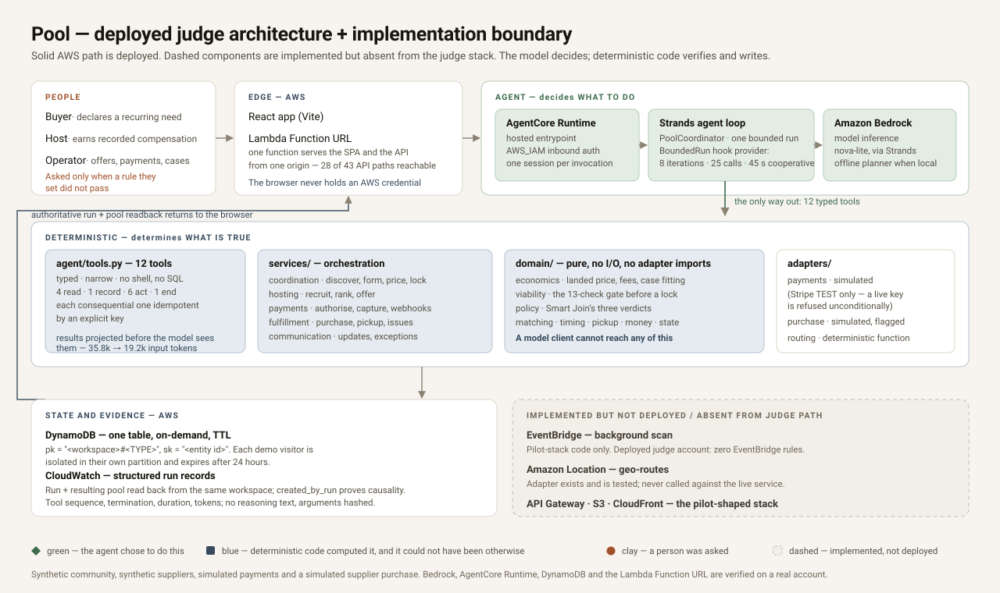

# Pool

**Nobody organised the group. Pool noticed.**

Pool finds the moment when several people in one community independently need the same
thing, works out whether buying it together is genuinely worth it, recruits a local
fulfiller with buyer-funded compensation, and runs the coordination that makes the
informal version collapse.

Built for the [AWS Agents for Humans hackathon](https://agentsforhumans.devpost.com/) —
**Good Neighbor Agents** track. The value is structurally collective: one person alone
cannot create it.



---

## Open this first

**<https://5hhaadit5pdarllqmbj24u4ybm0ixsyj.lambda-url.us-east-1.on.aws/>**

No signup, no password, no credentials. Pool opens on four short questions — what to call
you, roughly where you are, something you buy, and how much it may do without asking — and
knows nothing about you until you answer them. Type `vanilla whey` and pick the tub you
recognise. That standing declaration is the entire user input of the product; nothing
about it creates a group or invites anybody.

**On location:** Pool never asks your browser for a position, and never claims you are
near the people in the demo. The community is invented, and the setup screen says so.
Whatever city you are in, you explore Demo University from the inside.

Then press **Run Pool now** and the coordinator goes looking for overlapping demand it was
never told about. When it finds some, open the pool it formed and drive the rest — the
host answering, a card being declined, the repair, the order, the handover — from the
**Demo controls** drawer, which acts for the other synthetic participants.

Then, on that same pool's **Activity** tab, open **Technical proof for this run**. It
shows the exact AgentCore run that already formed the pool: run id, pool id,
`created_by_run`, tool sequence, model, termination, and authoritative database readback.
No second live invocation is needed; **Run again** is deliberately secondary.

Or run everything locally, offline and free:

```bash
make install     # Python agent, web app, CDK deps
make qa          # lint, typecheck, tests, build, secret scan
make dev         # API on :8000, web on :5173
```

---

## The problem, in one exchange

This already happens on every campus:

> "I can buy 50 tubs of protein powder in bulk for way cheaper than the store. DM me if
> you want one."

The informal version works, badly. Someone guesses the demand, fronts hundreds of
dollars of their own money, buys speculative stock, advertises afterwards, answers
thirty messages, tracks commitments, arranges meetups, and eats the leftovers.

Pool runs the same job in reverse:

```
people independently declare recurring needs
  → Pool discovers compatible demand nobody grouped
  → Pool evaluates a bulk offer, its minimum, and its case structure
  → a candidate pool appears, with an honest savings range
  → Pool recruits and ranks someone to collect and hand it out
  → the exact landed price becomes known
  → buyers authorise that exact amount
  → minimum, funding, host, timing and economics all pass
  → the pool locks, payments capture, one bulk order is placed
  → everyone collects in one concentrated pickup window
```

**Nobody creates the group. Pool discovers that the group can exist.** If the product
ever becomes "create a group and invite your friends", the whole thesis is gone.

The host is not a speculative reseller. They are a **compensated fulfilment provider for
pre-coordinated demand** — their compensation is part of the buyer economics before the
pool locks. The current demo records that compensation but has no payout rail.

---

## Three sides, one agent

```
CONSUMER DEMAND          "I want this, cheaper."
        ↕
      POOL
        ↕
BULK SUPPLY              "I can supply this quantity at this price."
        ↕
FULFILMENT LABOUR        "I'll collect and hand it out if the job pays enough."
```

A pool only locks if **all** of them work — plus Pool's own economics. That last
constraint is deliberate: a platform that quietly subsidises a transaction is a platform
that will stop existing.

---

## Run it

Everything below is free, offline, and deterministic. No AWS account, no API key, no
tokens spent.

```bash
make install     # Python agent, web app, CDK deps
make qa          # lint, typecheck, tests, build, secret scan
make demo        # the full lifecycle end to end, printed as a transcript
make dev         # API on :8000, web on :5173
```

Then open <http://localhost:5173>, set an account up, and press **Run Pool now**.

`make demo-local` runs the same app in **judge mode** — the reduced configuration the
public demo deploys in, served from a single origin on :8000.

### What the app is

Pool as a member of Demo University sees it. You are signed in as one of them; the
top-right control switches account, holds the demo controls, and explains what is real.

| | |
| --- | --- |
| **Home** | A short narrative, and only the parts of it that currently apply: what Pool needs you to answer, what it found *for you* — your units, your price, your pickup — what it handled across the Community without asking anyone, what you buy anyway, and, folded away, whether Pool may commit your money at all |
| **Pools** | The orders people are making together, and the full record of each one |
| **Needs** | What you buy anyway. Declare one, change one, or stop buying something — the product's primary action, and the only thing a member ever has to do. Product, quantity, cadence and how many days early you'd tolerate; the authorisation limits sit behind one disclosure with their values stated on it. Underneath: the community's standing needs, none of which are organised into anything |
| **Community** | Demo University, in the two currencies Pool saves: money created, then coordination avoided. Then the model behind them, the map, and where the money went |

A pool's own record carries the depth: **Overview**, **People**, **Economics**,
**Fulfilment**, and an **Activity** tab holding the audit trail, the agent's tool
sequence, the deployed AgentCore run, and a thirteen-stage reader for the whole
lifecycle. None of that is in the navigation, because a student buying protein powder
has no use for a Bedrock model id and a judge auditing the agent has nothing but use
for it.

Every action is attributed to one of three actors wherever it appears: **the agent chose
to do this**, **deterministic code computed it**, or **a person was asked**.

### Driving it alone

Pool is a three-sided product and a judge is one person. The **Demo controls** drawer
acts on behalf of the other synthetic participants — the host answering an offer, the
remaining buyers answering theirs, the scheduler opening the pickup window, everyone
collecting. Each control calls the same endpoint that participant would call, so the
state machine, the economics and every viability check still apply, and a control that
cannot legally run is not offered.

---

## The judge experience — live

The public demo is a **separate, tiny stack** — one Lambda behind a Function URL, serving
both the web app and a thirty-one-endpoint API, plus one DynamoDB table.

```
browser ──HTTPS──▶ Lambda Function URL ──▶ one Lambda
                                             ├─ the built SPA (same origin, no CORS)
                                             ├─ 31 allowlisted API paths
                                             ├─ DynamoDB — this session only, 24 h TTL
                                             └─ InvokeAgentRuntime — bound to this session
                                                       │
                                 AgentCore Runtime ◀───┘
                                   └─ Strands + Bedrock → typed tools
                                        → deterministic services → DynamoDB
                                             └─ same run + pool read back to browser
```

**The browser never holds an AWS credential.** The deployed AgentCore Runtime uses
`AWS_IAM` inbound auth, so something has to sign the request; that something is the
Lambda's execution role, whose only agent permission is `InvokeAgentRuntime` on one
runtime ARN.

What judge mode changes, and why each one matters:

| Reduction | Why |
| --- | --- |
| 32 of 49 endpoints exist; the rest 404 | Supplier-offer mutation, the operator pickup override, the payment webhook, and direct `lock`/`purchase` calls have no business on an anonymous URL |
| **No prompt surface.** The client sends an action *name*; the server owns the prompt | `coordinator.run(instruction=…)` replaces the entire run prompt — forwarding a client string would let a stranger write the agent's instructions |
| Per-session and per-day caps on every action that costs anything | An anonymous URL is a cost surface before it is a demo |
| One session per visitor, isolated by DynamoDB partition, expiring in 24 h | Two judges cannot see or corrupt each other's demo |
| A one-command kill switch, and the account's own concurrency ceiling | The only controls that do not depend on application code being correct |

### Deterministic by default, live where it says so

Almost everything a judge touches runs **deterministically on the server** — the real
Strands loop with the offline planner, the real domain maths, the real state machine.
That is deliberate: a demo that depends on a paid model call for every interaction is a
demo that breaks in front of someone.

Exactly one action leaves the machine, and it is the product's own: **Find
opportunities** invokes Pool's coordinator on **Amazon Bedrock AgentCore Runtime** — a
real model, a real Strands loop, real Pool tools — inside a runtime session generated
per invocation, **bound to the visitor's own DynamoDB workspace**. The pool that appears
afterwards was formed by that run: its `created_by_run` is the run id the runtime
reported, and the page renders it by re-reading the table rather than by drawing the
model's answer. The same invocation is auditable from a pool's *Activity → Technical
proof for this run*, which reports the exact run and pool ids, `created_by_run`, tool
sequence, model, token counts, termination reason, and same-workspace readback. It is
capped and labelled, and if it fails it says so. A fresh invocation is not part of the
demo path. **There is no code path that fabricates a run** (`AGENTS.md` §8).

The runtime is a *participant* in a workspace, never its owner. The API seeds workspaces,
resets them, and rations how many exist; the runtime's execution role can read and write
that one table and cannot delete from it, so `Repository.reset()` — the only operation
that empties a partition — is unavailable to the agent by construction
(`services/agent/iam/agentcore-dynamodb.json`). One live run per session at a time, held
by a conditional-write lease, because two coordination runs on one partition would both
find no pool and both create one.

That call takes ten to twenty seconds, so the screen spends them saying something true.
It shows the path the request takes, the caps the run is bounded by, and the complete
list of tools the agent is allowed to choose from; when the answer comes back, the ones
it actually chose are marked, in order. A browser making one HTTPS request can observe
its own send and its own receive and nothing in between, so nothing animates a journey
through AWS it did not watch. Three real, separately measured durations come back with
the result: time inside the agent, time inside AWS, and the browser's own round trip.

```bash
make demo-local   # judge mode, locally, free
make demo-synth   # synthesize the stack — offline, creates nothing
make deploy-demo  # (COSTS MONEY)
make demo-url     # print the deployed URL
make demo-kill    # stop it answering, without deleting anything
make destroy-demo # remove the stack
```

---

## Community is the boundary, campus is the wedge

A **Community** is the local trust-and-density boundary Pool coordinates inside: a
campus, an apartment complex, a neighbourhood, a workplace. Campuses are the first
polished experience because they have high density, overlapping recurring needs,
walkability, public pickup points, and predictable weekly schedules — not because the
domain is university-shaped. A university is one `CommunityKind`, not a global
assumption. Pools form *within* a Community; cross-community pooling is out of scope for
this build.

**Account authentication and Community membership are separate questions.** You can have
a Pool account without being a verified member of anything, and membership is per
Community, so one account belonging to both a campus and an apartment block is a schema
fact rather than a future migration.

Verification is an abstraction with two working providers:

| Provider | What it proves |
| --- | --- |
| `DemoVerificationProvider` | Nothing. Admits anyone to a synthetic Community. Judge Mode uses this. |
| `EmailDomainVerificationProvider` | Control of an address on a Community-approved domain. Stores the *domain* and a hash — never the address. |
| `FutureInstitutionalSSOProvider` | Documented, not implemented. Requires an institution's agreement, which is not a coding task. |

**Pool never asks anyone for their institution's password**, never scrapes a login page,
and never claims an integration that does not exist.

---

## The canonical lifecycle

```
RECURRING NEEDS → LATENT DEMAND → CANDIDATE POOL
  → SUPPLIER / MOQ EVALUATION → HOST RECRUITING → HOST SELECTED
  → SUPPLIER QUOTE REFRESHED → FINAL LANDED ECONOMICS → FINAL OFFER
  → SMART JOIN / HUMAN DECISION → PAYMENT AUTHORISATION → FUNDED
  → FINAL VIABILITY CHECK → LOCKED → CAPTURE → PURCHASE_READY
  → SIMULATED PURCHASE → PURCHASED → DISTRIBUTING → ONE-TIME QR → COMPLETED
```

Implemented as `PoolStatus` with an explicit adjacency table in
[`domain/state.py`](services/agent/pool/domain/state.py). Two properties are asserted by
tests rather than assumed: nothing reaches `LOCKED` except through `FUNDING` or
`RECOVERING`, and nothing rewinds out of a captured state.

Failure is normal, so the branches are real: no viable host, host declines, host offer
expires, quote goes stale, quote materially changes, authorisation fails, buyer withdraws
pre-lock, capture fails, purchase fails, buyer no-shows, credential re-used.

---

## The parts that are easy to get wrong

### Provisional participation is not financial commitment

A candidate pool counts **provisional** demand so the opportunity can be discovered and
shown. Only **authorised** demand counts toward the funded threshold. Adding a recurring
need never touches anyone's card.

```
ELIGIBLE → PROVISIONAL → FINAL_OFFERED → AUTHORIZED → LOCKED
```

### The host is chosen before anyone is charged

Host compensation is part of the buyer's price, so the order is fixed: host accepts →
quote refreshed → exact landed cost → final offer → buyer policies evaluated →
authorisation → lock. Pool never authorises $42 and later charges $47. If the price
moves before lock, the stale hold is released and the buyer is asked again.

### The price includes everything

```
  bulk merchandise
+ host / runner compensation
+ payment processing
+ Pool platform fee
= all-in Pool cost

retail comparison − all-in Pool cost = net savings
```

Smart Join is evaluated against **net** landed savings. Two subtleties are load-bearing:
the platform fee is a share of *gross* savings, so it is defined without referring to the
total it belongs to; and card processing is **grossed up** per buyer, so the charge
covers the processor's cut of that very charge. Computing it the naive way would
under-recover by a few cents per buyer — a silent platform subsidy, which is exactly what
the model forbids.

If fair host compensation erases the saving, the pool should not form. That is a correct outcome,
not a bug.

### Pool does not buy stock nobody ordered

Cases do not divide evenly into demand. Rather than quietly buying the leftovers and
billing someone for them, Pool **chooses the buyer set that fills whole cases exactly**
([`fit_to_cases`](services/agent/pool/domain/economics.py)), preferring people whose need
is already due over demand pulled forward. If no combination lands on a case boundary,
the pool does not lock and says why.

### Future demand moves only with permission

Each need carries two different timing numbers: a **routine restock lead** (when someone
normally buys) and an **earliest acceptable purchase date** (how far ahead they are
willing to buy if it saves money). The agent may decide to *investigate* whether more
demand exists; the deterministic timing engine decides *who is actually eligible*. A
member who authorised no early purchase is never pulled forward, however convenient it
would be for the case count.

In the demo this is not decoration, and the split is a figure the transcript carries
rather than a claim the interface makes: **eight people were buying about now anyway —
18 units, against a supplier minimum of 24. Two more had authorised an early purchase,
and their 6 units close the gap exactly.** Ten people, twenty-four units, two whole
cases. Take away the pull-forward pair and this pool does not form.

### Ten people bought. The record shows eleven

The counts move once, and the run says so where it happens. Ten people are matched at
discovery. One card is then declined, and recovery finds one replacement — so ten people
still buy, and the pool's record carries **eleven memberships**, the extra one being the
failed authorisation. It stays visible on the pool page instead of being deleted, and
every surface reports both numbers: `buyer_count` alongside `member_count`.

### Offering to host is not claiming the job

Candidates come from two places: standing hosts who opted in earlier, and ordinary pool
members who click "Offer to host" on this specific pool. Several people can offer at
once. A deterministic evaluator checks facts — availability, vehicle, capacity, weight,
supplier travel, pickup-site suitability, their own minimum pay — and ranks the eligible
ones on the whole transaction, not the cheapest line. The top candidate gets an offer.
If they decline or the window expires, the next one does. There is no
first-come-first-served path.

Compensation scales with the work: base + per order + distance + exceptional weight +
an optional handoff component. A buyer no-show cannot erase pay for a run already done —
only the handoff slice is contingent.

### Pickup is proved, not asserted

Every buyer allocation gets its own one-time credential: a long token for the QR and a
short human-readable code for when scanning is awkward. **Only hashes are stored.** The
plaintext exists exactly once, in the response that issued it; re-issuing invalidates the
previous pair. The credential carries no payment details, phone number, or email. A host
cannot mark an order collected without one — the only other route is an operator override
that requires a stated reason and is audited.

### Communication is exception-driven

Routine communication is automated; human messaging is the exception. There is no pool
group chat. Buyers get structured exceptions first ("running late", "can't pick up
today"), most of which Pool resolves with nobody's attention; a product problem becomes an
operator case rather than an argument at the pickup table; only what is left opens a
private, transaction-scoped buyer ↔ host thread that archives with the pool. No phone
number or email is ever exposed.

---

## AI decides what to do. Deterministic code determines what is true.

| The model may decide | Deterministic code determines |
| --- | --- |
| which latent demand deserves investigation | cents, quantities, package maths |
| whether to search or refresh offers | MOQ, allocations, offer freshness |
| whether a candidate pool is worth forming | timing eligibility, product compatibility |
| whether to recruit a host | host eligibility and compensation |
| which recovery strategy to attempt | buyer landed price, platform fee |
| whether to surface a human decision | payment and funding state |
| when there is nothing worth doing | pickup-code validity, state transitions |
| | Smart Join verdicts and final viability |

The agent reaches the world through twelve narrow typed tools and nothing else — no
shell, no arbitrary SQL, no generic mutation. Every tool is either a safe read or a
single consequential operation with idempotency and an approval boundary built in.

**Smart Join** returns one of three verdicts, never "close enough":

```
AUTO_APPROVED   HUMAN_APPROVAL_REQUIRED   NOT_ALLOWED
```

`NOT_ALLOWED` is reserved for situations no prompt can fix — a product outside the
member's substitution authority, or a scheduling conflict with the pickup day.

---

## Bounded by construction

Every run is bounded in the Strands event loop, not by asking the model nicely:

| Bound | Default | Behaviour on hit |
| --- | --- | --- |
| `MAX_AGENT_ITERATIONS` | 8 | Terminates the run as a recorded loop fault |
| `MAX_TOOL_CALLS_PER_RUN` | 25 | Global circuit breaker |
| `MAX_DUPLICATE_TOOL_CALLS` | 2 | Identical name+args cancelled as a loop |
| `WORKFLOW_TIMEOUT_SECONDS` | 45 deployed (120 local default) | Cooperative wall-clock bound checked between model/tool steps; it does not interrupt a call already in progress |
| `MAX_ROUTE_MATRIX_CELLS` | 100 | Checked *before* any routing call is billed |

A run that hits a bound ends loudly with a `loop_fault` outcome — never a silent
truncation that looks like a normal result. The deployed judge account has **zero EventBridge rules**;
no background schedule exists there.

---

## Local mode, and what is not real

| Layer | Local / demo | Would a pilot change it? |
| --- | --- | --- |
| Model | Deterministic offline planner, real Strands loop | Swap to `BedrockModel` |
| Persistence | In-memory | DynamoDB single table (adapter exists) |
| Routing | Deterministic function of coordinates | Amazon Location `geo-routes` (adapter exists) |
| Payments | `LocalSimulatedPaymentProvider` | Stripe **TEST** provider (refuses non-test keys) |
| Purchase | `SimulatedPurchaseExecutor` — every record flagged synthetic | A merchant-of-record decision, not a code change |
| Community | Demo University, entirely invented | A real Community with real verification |
| Your account | Real — the name and choices you enter during setup | Add authentication; this is a profile, not a login |
| Your location | **Never collected.** Setup names the community instead | Device location, once there are real neighbours to find |
| Product identity | **Real.** A dated Open Food Facts snapshot, bundled | Widen the snapshot; add first-party photography |
| Supplier offers | Invented — price, case size, minimum | Operator-verified quotes (`ManualVerifiedOfferProvider` exists) |

The offline planner replaces **the LLM and only the LLM**. The Strands event loop, the
tools, the domain maths, the state machine, the policy engine, the payment state machine,
and the human-in-the-loop boundary are all the real thing. That is what makes the whole
test suite free to run — and cheap tests are tests that actually get run.

It is not evidence that Bedrock works, and it is never presented as such: every run
records `model_provider`, and the UI shows it.

**Not real, and labelled as such everywhere:** the Community, the members, the suppliers,
the offers, the money, and the purchase. No goods move. No traction is claimed.

**Real, because it costs nothing to be:** the products themselves. A member types
`vanilla whey` and picks a tub they recognise, with the actual photograph. That comes from
a curated Open Food Facts snapshot committed to this repository — 295 products, bundled
rather than fetched, so the first interaction in the product works with the network
unplugged and ranks identically on the tenth rehearsal as on the first.

The line between those two paragraphs is the one to hold. A real brand beside an invented
wholesale price could imply a relationship that does not exist, so the catalogue supplies
**identity only** — name, brand, flavour, photograph — and never a price, a case size or a
supplier minimum. Those stay curated, and the seven products Pool holds a synthetic
supplier quote for deliberately publish **no barcode**, because a barcode names one
specific retail package and Pool's case structure was invented for the scenario. Details and licence
obligations: [`services/agent/pool/data/CATALOG_LICENSE.md`](services/agent/pool/data/CATALOG_LICENSE.md).

---

## AWS

**Bedrock inference is verified** on both the discovery path (`make verify-bedrock`) and
the consequential recovery-and-lock path (`make verify-recovery`): a real model drives the
real Strands loop and the real Pool tools, and the deterministic viability engine refuses
the lock it is not allowed to take. **The AgentCore Runtime is deployed** and answering.
The pilot-shaped stack also synthesizes, but it is not the deployed judge architecture.
Nothing in this repository claims a deployment that has not happened.

| Service | Role | Status |
| --- | --- | --- |
| Bedrock | Model inference via Strands | **Verified** — `us.amazon.nova-lite-v1:0`; discovery, recovery, and lock branches all driven by real runs |
| AgentCore Runtime | Hosted agent entrypoint | **Deployed and verified** — `agentcore_app.py`, `READY` in `us-east-1`, live invocations proving AgentCore → Strands → Bedrock → Pool tools |
| Lambda Function URL | The public judge demo: web app + reduced API | **Deployed and verified** — full lifecycle on a real DynamoDB table, and a live AgentCore invocation from a public browser |
| DynamoDB | Authoritative application state, single table, on-demand, TTL | **Deployed and verified** — the complete 13-step lifecycle runs on the real table with identical economics |
| API Gateway + Lambda | Pilot-shaped API | In `PoolStack`, which is **not** what the public demo deploys |
| S3 + CloudFront | Pilot-shaped web hosting | In `PoolStack`. The public demo needs neither |
| EventBridge | Optional future background scan | Implemented only in the un-deployed `PoolStack`; **zero rules exist in the deployed judge account** |
| Amazon Location | `geo-routes`, no provisioned calculator | Implemented, unverified |
| CloudWatch | Structured run records, retention capped at 14 days | In both stacks |

```bash
make whoami   # which principal am I? run this first
make synth    # synthesize the template — no credentials needed
make deploy   # (COSTS MONEY)
make cost-check
make destroy
```

### AgentCore

The hosted coordinator is deployed with the official `@aws/agentcore` CLI, whose project
config lives in `agentcore/`. Only `agentcore.json` and `aws-targets.json` are committed;
the CDK app the CLI deploys through is generated, per that CLI's own convention. From a
fresh clone:

```bash
make install-agentcore   # installs the CLI, then rebuilds agentcore/cdk/
make agent-validate      # config check — offline and free
make agent-dry-run       # synthesizes the stack; creates nothing
make deploy-agent        # (COSTS MONEY)
```

`make agentcore-cdk` rebuilds `agentcore/cdk/` on its own by copying the installed CLI's
bundled assets. It refuses to overwrite an existing directory unless passed `--force`, and
warns if the installed CLI is not the version this repository was verified against.

The first `agentcore deploy` needs a CDK bootstrap in the account — a separate,
account-wide step that grants `AdministratorAccess` to a CloudFormation execution role.
It is deliberately not automated here (`AGENTS.md` §3.5).

See [`docs/COST_NOTES.md`](docs/COST_NOTES.md) for the resource ledger and
[`AGENTS.md`](AGENTS.md) §3 for the cost rules every change is held to.

---

## Repository

```
services/agent/pool/
  domain/          pure, deterministic, no I/O — the things that must be *correct*
    models.py        entities and enums
    economics.py     landed price, host reward, fees, case fitting
    viability.py     the central four-party viability engine
    policy.py        Smart Join
    hosting.py       host evaluation and ranking
    matching.py      latent-demand discovery
    timing.py        Pool Days, windows, pull-forward authority
    substitution.py  structured product substitution
    pickup.py        one-time credentials
    money.py         exact-cent arithmetic
    state.py         the lifecycle adjacency table
  services/        orchestration over the domain — everything the agent can *do*
  adapters/        repository, routing, payments, purchase, sourcing, verification
  agent/           Strands coordinator, tools, bounds, result projection, offline planner
  api/             FastAPI
  data/seed.py     the synthetic Demo University dataset
apps/web/src/
  styles.css       the design system: paper, ink, and the three-actor colour grammar
  brand.tsx        the mark, and the one figure that explains the mechanism
  ui.tsx           primitives — actors, figures, ledgers, traces, drawn icons
  views/           overview · run · live · community · operations · pool
infra/             CDK stack + cost-safety tests
docs/              architecture, pilot readiness, thesis, demo script, scorecard
```

---

## Docs

- [`docs/ARCHITECTURE.md`](docs/ARCHITECTURE.md) — what is actually built, and how
- [`docs/PILOT_READINESS.md`](docs/PILOT_READINESS.md) — what a real pilot still needs, including the parts that are legal questions rather than coding ones
- [`docs/STARTUP_THESIS.md`](docs/STARTUP_THESIS.md) — the business argument and its assumptions
- [`docs/DEMO_SCRIPT.md`](docs/DEMO_SCRIPT.md) — the five-minute story
- [`docs/HACKATHON_SCORECARD.md`](docs/HACKATHON_SCORECARD.md) — evidence per judging criterion, honestly graded
- [`docs/RELEASE_CHECKLIST.md`](docs/RELEASE_CHECKLIST.md) — everything that must be true before submitting, with the human-only items left as TODO rather than assumed
- [`docs/COST_NOTES.md`](docs/COST_NOTES.md) — every resource that can accrue cost
- [`BUILD_HISTORY.md`](BUILD_HISTORY.md) — decisions, rejected approaches, and what broke
- [`AGENTS.md`](AGENTS.md) — the operating manual any agent working here must follow

## Licence

MIT — see [`LICENSE`](LICENSE) — with one deliberate exception.

The bundled product catalogue (`services/agent/pool/data/catalog.json` and the images in
`apps/web/src/assets/products/`) is a curated subset of Open Food Facts and its sister
projects, used under **ODbL 1.0** with product photographs under **CC-BY-SA 4.0**. It is
kept in its own files so that boundary is unambiguous, and the attribution the licence
requires is rendered in the app under *About → Product data and credits*. See
[`services/agent/pool/data/CATALOG_LICENSE.md`](services/agent/pool/data/CATALOG_LICENSE.md).
