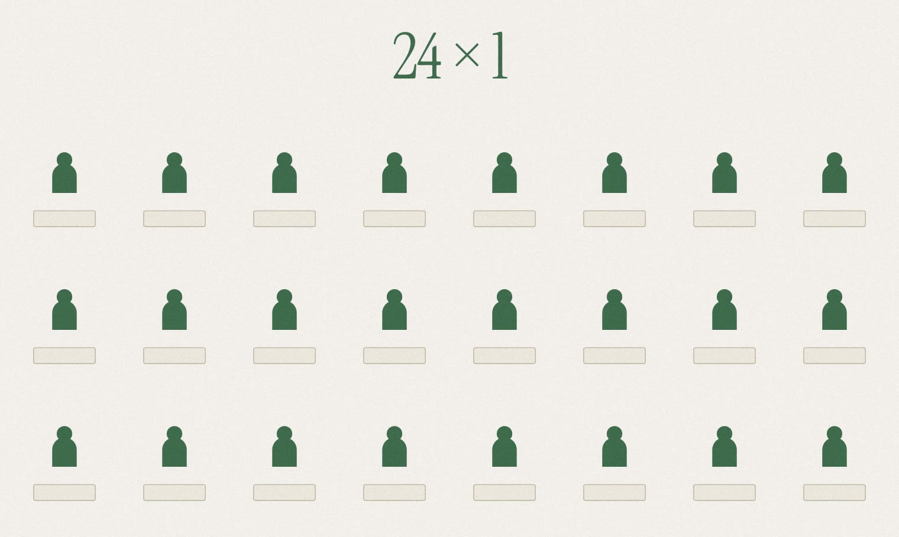

# Agents for Humans: What if bulk buying didn't require one person to buy in bulk?

Costco gives one person the purchasing power of twenty-four buyers, and in exchange that person takes home twenty-four of something. Which is fine if you need twenty-four.

[Pool](https://github.com/nimarco/pool) is what I built for the Agents for Humans hackathon, and [the demo is public](https://d38kno05ygcarw.cloudfront.net/verify). Twenty-four people each get one, and nobody has to organise the group.

## The assumption I started from

The premise I started with was that informal group buying already happens and is just miserable to run. Someone posts "I can buy 50 tubs of protein powder way cheaper than the store, DM me if you want one," then guesses the demand, fronts their own money, buys the stock before everyone has committed, chases payment, arranges meetups, and eats whatever is left.

I wrote that premise into the project docs on day one. At that point I hadn't validated the campus version with people who had actually run buying groups, so I treated it as a product hypothesis rather than pretending it was research.

## The rule I wrote before writing any code

Before the first line of Python I wrote down one constraint everything else had to obey: the user should not have to create the buying group. If a person has to notice the opportunity first, the software isn't doing the hard part.

So the only thing a member does is say what they already buy. Coffee, three bags a month, and how many days early they'd tolerate restocking. There is no create-a-pool button anywhere in the app and there never was.

I was confident about that part. What I got wrong was how hard it is to *say* what you buy.

## Twelve people bought coffee and Pool formed nothing

I ran the engine over a small synthetic community instead of arguing about the design. Twelve households who all buy coffee, three bags each. Thirty-six bags of demand against a supplier minimum of eighteen.

Pool formed nothing.

Nothing was broken. Nine of the twelve declarations were being thrown out as "member accepts the exact product only" before timing or location were even checked. The demand overlapped in every sense a person would mean and none the code could use, because the only sentence a member could express was "I buy this exact bag."

My first fix was letting people declare a category: "coffee, I don't care which." Too blunt. The catalogue's coffee category has twenty-six entries including a vanilla creamer and a bottled Frappuccino, and nobody means that.

What people actually have is in between. Whole bean, caffeinated, medium or dark, never ground, never decaf. That isn't a list of approved products, because it describes bags you've never seen, so I had to build a way to say it.

On screen you don't pick a substitution policy, you get asked whether it has to be whole bean. Skipping a question always narrows your rule and never widens it.

![The flexibility section of Pool's declaration screen. A choice between "Only this exact coffee" and "Any brand that matches my preferences", with the second selected. A note reads that 4 other members have asked for this exact coffee, and that allowing alternatives reaches 12 requests across 6 products Pool can source. Below it, the questions Pool decided were worth asking: which roasts work — Dark and Medium ticked, Light not — and whether it has to be whole bean and has to be caffeinated, each showing how many coffees and units that answer keeps.](images/article-1-declare-flexibility.png)

## Nobody presses run

For a while there was a "Run Pool now" button, and it produced my favourite bug report of the build: *"I declared coffee. Pool showed me whey."*

The coordinator was right — the screen was showing the oldest order in the workspace, which belonged to twelve other people. But the button was wrong too. Pressing run puts you back in the organiser's chair. Saving your declaration is now the only thing that causes anything.

## Where the agent came in

The tidy version of this story isn't true.

I picked Strands on day one, before I had a decision worth giving it. For the first week the agent's job was thin: read a queue of unmet demand that was already sorted, evaluate the top item, form an order. "Investigate the first thing" was basically the entire policy.

The coffee work changed that. Once someone can say "whole bean, caffeinated, medium or dark," one declaration stops pointing at one possible order. It points at several, each with different people in it, a different supplier, and a different answer. Now something has to pick which one to investigate, and react when the answer comes back no.

That's the part the agent does. Everything that has to be correct — who qualifies, quantities, prices, whether it's worth doing at all — is ordinary code the model can't reach.

The first time Pool refused an order, it refused the one I would have picked. That's the next post.
