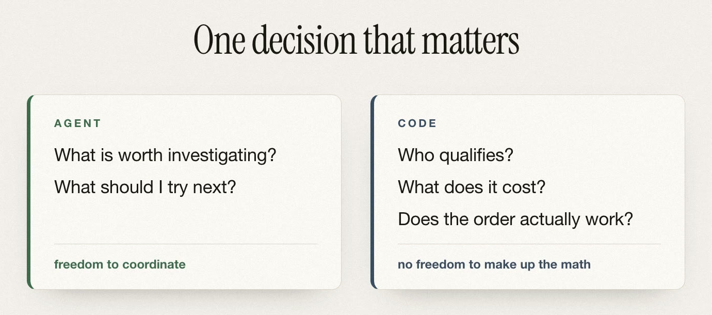

# Agents for Humans: More demand doesn't always mean a better group order

Pool is a group-buying coordinator I built for the Agents for Humans hackathon. You tell it something you already buy, and it looks for enough compatible demand nearby to order it together.

There's one moment in the demo I didn't design. It fell out of the arithmetic, and it's what convinced me the agent was earning its keep.

## The option that looked better

You add a coffee you buy: Kestrel medium roast, three bags. Another brand is fine, as long as it's whole bean and caffeinated, and dark roast works too. Then you save — the only thing you do.

Pool lists two orders it could assemble from what the community has already declared, with no prices on either:

- **Kestrel medium** — 23 bags of compatible demand across 8 people
- **Harbourstone dark** — 18 bags across 6 people

Kestrel is the obvious one: more people, more bags, more headroom over the minimum, and it's the coffee I actually named. So that's what Pool costs first.

Kestrel's wholesaler sells in cases of five. Twenty-three bags of compatible demand can fill four whole cases, so Pool costs a 20-bag order and leaves three bags of demand unserved. Then it prices everything: the coffee, the neighbour paid to collect and hand out the order, card processing, and the platform's cut.

**$367.19 together. $360.00 if those eight people just bought their twenty bags separately.**

So Pool refuses it. The reason is boring: that bag is barely discounted at wholesale, $15.70 against an $18.00 shelf, and 13% off doesn't survive paying a human to do the fulfilment.

Then it costs Harbourstone: discounted hard, sold in sixes, lower minimum. Eighteen bags is exactly three whole cases, nothing spare. **About $69 saved, a little over 20%.** Pool forms that order instead — provisionally, with no card touched and nobody yet signed up to carry it.

## The demo couldn't have done this a week earlier

My original scenario was whey protein, a dozen students buying the identical tub. That can answer *is this worth doing*, but it can't exercise a search: when everyone wants the same thing there's one candidate, and *which* never comes up.

Building the messier version created something to search, and the first time I ran it the option with the most demand behind it lost money. I hadn't arranged that: the demand and supplier terms are scripted, but nothing in the fixture is tagged as the one that should fail.

## The test I wrote instead of an argument

"The model made a real decision here" is unfalsifiable, so I turned it into something I could check. I took the obvious shortcuts anyone would reach for — first in the list, most demand, most people, fewest exclusions, most headroom over the minimum — and checked what each one picks.

All five pick Kestrel. All five pick the one that loses money.

That's a narrow claim and it's the honest one. It doesn't say the problem is hard, it says you can't get the right answer out of the summary — you have to cost something and see what comes back. "This group pays $7.19 more than they would separately" isn't a fact until a set of buyers has been priced.

## What the model does and doesn't decide

You could write all of this as normal code. But the branching adds up fast: several products and suppliers, substitution rules that vary per person, candidates that fail on price or on case fitting or because the person who asked can't fit into them, and then whether to try again or stop.

So I split it. The agent, running on [Strands](https://strandsagents.com/), gets two questions — what's worth investigating, and what to try next when that came back no. Ordinary code decides everything that has to be correct: who qualifies, quantities, how the cases fill, what it costs, whether it's viable.

The model does not decide whether $367.19 is more than $360.00. There's no route by which it could. That refusal comes from the same pricing code that prices every order in the system, and the run just receives the verdict.

## Where this runs

[The public demo](https://d38kno05ygcarw.cloudfront.net/verify) runs the real Strands loop and the real tools with a deterministic planner in place of the model, so the trace is free to reproduce and the function serving it can't call a model at all. The same bounded agent is deployed separately to [Amazon Bedrock AgentCore Runtime](https://aws.amazon.com/bedrock/agentcore/) against Amazon Nova Lite, over the same DynamoDB state.

A bounded run there executed on Nova Lite — six tools, terminated `completed` — and the order it formed was read back out of DynamoDB afterwards, with `created_by_run` matching the run that made it rather than being taken from that run's own response.

What it is not is a recording of Nova picking Harbourstone. The cohort search that produces this refusal is selected by a coordination event, and the hosted entry point doesn't accept one — so the Kestrel-to-Harbourstone run on Nova Lite went through the same Strands loop by the local path instead. Both traces are in the repo. I'd rather name which is which than let one good-looking trace stand in for the other.
