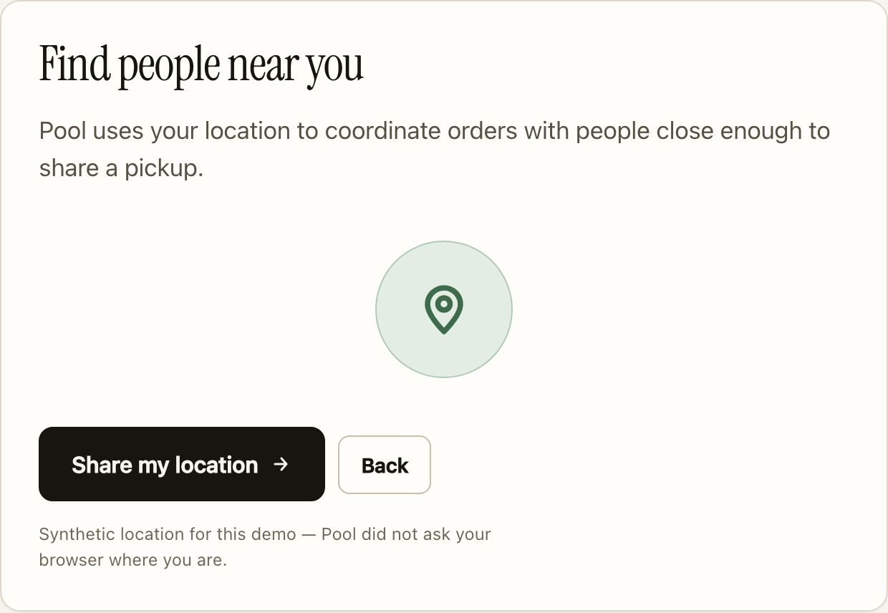

# Agents for Humans: How I built a group-buying demo without pretending the fake parts were real

[Pool](https://github.com/nimarco/pool) coordinates group purchases between neighbours. I built it for the Agents for Humans hackathon, which meant something a stranger could open and use in a world with no neighbours, no suppliers, and no money.

The obvious move is to make the fake parts convincing. I went the other way, and it made the demo better: the part I wanted to show, the coordination, works either way.

The rule I settled on: everything the coordinator does is real, everything it can't do yet is labelled. The community, households and supplier quotes are synthetic. Payments and purchasing are simulated — no card charged, no supplier contacted. Compatibility, case fitting, pricing, the agent loop and every record you can read back are real code running on that synthetic data. Here's where holding to that cost me something.

## Letting things stay unresolved

Alongside coffee I declare paper towels. Pool finds seven packs of demand nearby; the supplier minimum is forty-eight. So nothing forms, my declaration stays standing, and the screen tells me what's missing.

Seeding a world where every declaration resolves would have been easy, and it proves nothing: a system that always finds a deal is one you can't trust when it does.

There's a copy bug from this I think about. A refusal used to end with "so there was plenty", written for a different refusal and printed on all of them — so the paper-towels screen described seven packs against a minimum of forty-eight as *plenty*. The logic was right the whole time. The sentence wasn't, and the sentence is what a person reads.

The order that does form says **host needed**, because no neighbour has agreed to collect it yet, with one line explaining that hosts get paid. Nothing invents an acceptance to make the screen look done.

## Taking it back

Plenty of agent demos show the system doing something. Very few show you undoing it.

If I edit my coffee declaration to *only this exact coffee*, Pool takes my units back out of the order. It re-forms without me, to a whole case, and my declaration goes back to standing. Nobody is charged.

I got this wrong in the video script. I'd written that Pool would "rather lose the order" than substitute against a preference. It actually removes me and lets the order survive, so the script changed.

## Asking for a location without taking one

Until a few days ago, setup showed the demo community as *Communities near you · 1 found · Demo University · 24 members.*

That was honest and it taught the wrong thing: a reader met Pool through the name of an invented university, which then sat in the top bar of every screen. Pool is meant to work wherever people are dense enough to share a pickup: apartment blocks, neighbourhoods, workplaces. A campus is one case of that, not the shape of the thing.

Now the step asks for one thing: *Share my location.* It does not call the browser's geolocation API, and never has. No screen reports "shared", a place name, or a coordinate, and a test asserts that silence. Underneath, small: *Synthetic location for this demo — Pool did not ask your browser where you are.*

## The AWS half of the same decision

[The public demo](https://d38kno05ygcarw.cloudfront.net/verify) runs the real Strands loop and the real tools with a deterministic planner in place of the model. The LLM is the only substituted piece, and every run records its provider, so nothing gets passed off as a model decision.

Two reasons, neither of them hiding anything. It makes the demo reproducible — run it ten times, same trace, free, no account — and nobody can spend my credits, because the function serving that page has no permission to call a model.

Live model execution is a separate deployment: the same bounded agent on Amazon Bedrock AgentCore Runtime against Amazon Nova Lite, over the same DynamoDB table, switched off for public visitors.

## Audit your own true sentences for expiry

The verification page claimed there was no *run* button, which was true when I wrote it. Then Home got an **Ask Pool to check now** button one click away, and the denial outlived its truth — a reader could have disproved my page without leaving the walkthrough.

Saying what the button actually does was the better sentence, because it survives someone pressing it.
